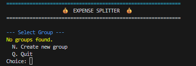
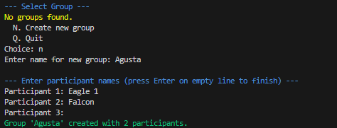
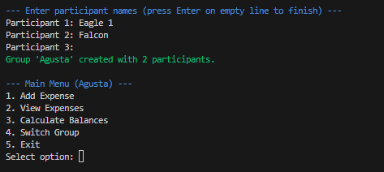

<h1 align="center">💸 Expense Splitter</h1>

  A simple Python CLI tool to track shared expenses between group members, calculate balances, and store records in JSON files.

<h2>✨ Features</h2>
<ul>
  <li>Create multiple groups and save them as JSON files.</li>
  <li>Add participants dynamically (not limited to 2 people).</li>
  <li>Add expenses with description, amount, and automatic timestamp.</li>
  <li>Calculate balances showing who owes whom.</li>
  <li>Automatically updates the JSON file after each expense.</li>
  <li>Aesthetic CLI with banners and colors for better user experience.</li>
</ul>

<h2>⚙️ Installation</h2>
<pre>
  git clone https://github.com/Agustasvj/Expense_Splitter_CLI.git
</pre>
<pre>
  cd Exxpense_Splitter_CLI
</pre>
<pre>
  python expense_splitter.py 
</pre>

<h2>🚀 Usage</h2>
<ol>
  <li>Run the script.</li>
  <li>Select or create a group.</li>
  <li>Add expenses as they occur.</li>
  <li>View balances anytime.</li>
  <li>Exit when done (data is saved automatically).</li>
</ol>

<h2>📖 Example Run</h2>
<ul>
  <h2>1. Select Group</h2>
  
  <h2>2. Create Group</h2>
  
  <h2>3. Main Menu</h2>
  
</ul>

<h2>🔮 Future Improvements</h2>
<ul>
  <li>Add email/SMS notifications.</li>
  <li>Add web/GUI interface.</li>
  <li>Export reports to PDF or Excel.</li>
</ul>

<h2>📜 License</h2>

MIT License

